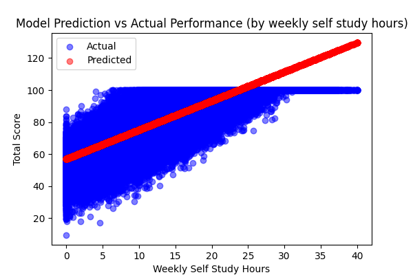

# Student Performance Prediction (ML Project - V1)

Version: V1 (Basic Supervised ML Model)

---

## Problem Statement
Predict student performance based on study habits, attendance, and class participation using Machine Learning.

---

## Type of Project
- Supervised Machine Learning  
- Regression Problem  
- Target Variable: `total_score`

---

## Dataset Features
- Student id
- Weekly Self Study Hours  
- Attendance Percentage  
- Class Participation  
- Total Score (Target)  
- Grade  

---

## Tech Stack
- Python  
- Pandas  
- NumPy  
- Matplotlib  
- Scikit-learn  

---

## ML Pipeline

1. Data Loading  
2. Data Preprocessing (handling missing values)
3. Train-Test Split  
4. Model Training (Linear Regression)  
5. Model Evaluation  
6. Visualization  
7. Prediction using user input  

---

## Model Performance

- Mean Absolute Error (MAE): ~7.16
- Mean Squared Error (MSE): ~80.94
- Root Mean Squared Error (RMSE): ~9.00
- R² Score: ~0.66

-> Accuracy of model is more better than an avg model

---

## Visualizations & Insights

### Study Hours vs Total Score

Insight:
- Strong positive linear relationship  
- Higher study hours → higher score  
- Most influential feature  

---

### Attendance vs Total Score

Insight:
- Weak correlation  
- Attendance alone is not a strong predictor  

---

### Class Participation vs Total Score

Insight:
- Moderate influence  
- Less impactful than study hours  

---

## Prediction Feature

Model allows user to input:
- Study Hours  
- Attendance  
- Participation  

-> Returns predicted student score  

---

## Author
Priyal Sagar
